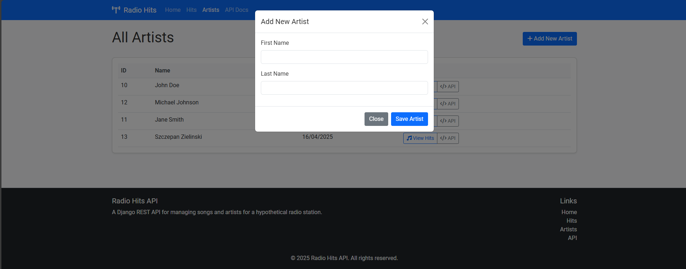

# Radio Hits API

A Django REST API with Frontend for managing songs (hits) and artists for a hypothetical radio station.

## Overview

This project provides a complete solution for managing radio hits and artists with:

- RESTful API endpoints for data management
- Modern frontend interface built with Bootstrap
- Automatic URL slug generation
- Database models with proper relationships
- Unit tests
- Data population command

## Technical Stack

- Python 3.6+
- Django 3.0+
- Django REST Framework
- PostgreSQL 13+
- Bootstrap 5
- JavaScript (Fetch API)
- HTML/CSS
- Unit tests (Django TestCase)

## Database Schema

### Artist
- id (PK)
- first_name (CharField)
- last_name (CharField)
- created_at (DateTimeField)
- full_name (property)

### Hit
- id (PK)
- title (CharField)
- artist (FK to Artist)
- title_url (SlugField, unique, auto-generated)
- created_at (DateTimeField)
- updated_at (DateTimeField)

## API Endpoints

| Method | Endpoint | Description |
|--------|----------|-------------|
| GET | `/api/v1/hits/` | List all hits (limited to 20, sorted by creation date) |
| GET | `/api/v1/hits/{title_url}/` | Get details of a specific hit |
| POST | `/api/v1/hits/` | Create a new hit |
| PUT | `/api/v1/hits/{title_url}/` | Update an existing hit |
| DELETE | `/api/v1/hits/{title_url}/` | Delete a hit |
| GET | `/api/v1/artists/` | List all artists |
| GET | `/api/v1/artists/{id}/` | Get details of a specific artist |

## Response Codes

- 200: Successful GET or PUT request
- 201: Successful POST request (resource created)
- 204: Successful DELETE request (no content)
- 400: Bad request (invalid data)
- 404: Resource not found
- 500: Server error

## Installation and Setup

1. Clone the repository
```bash
git clone https://github.com/zielu2021/radio-hits-api.git
cd radio_hits_api
```

2. Set up a virtual environment
```bash
python -m venv venv
source venv/bin/activate  # On Windows: venv\Scripts\activate
```

3. Install dependencies
```bash
pip install -r requirements.txt
```

4. Set up the database
```bash
python manage.py migrate
```

5. Populate database with initial data
```bash
python manage.py populate_data
```

6. Run the development server
```bash
python manage.py runserver
```

7. Access the application
   - Frontend: http://localhost:8000/
   - API: http://localhost:8000/api/v1/

## Running Tests

```bash
python manage.py test
```

## API Usage Examples

### Create a new hit (POST)

```
POST /api/v1/hits/

{
  "title": "New Hit",
  "artist_id": 1
}
```

Response:
```json
{
  "id": 54,
  "title": "New Hit",
  "artist": {
    "id": 7,
    "first_name": "John",
    "last_name": "Doe",
    "created_at": "2025-04-16T09:30:30.755012Z",
    "full_name": "John Doe"
  },
  "title_url": "new-hit",
  "created_at": "2025-04-16T09:54:57.765240Z",
  "updated_at": "2025-04-16T09:54:57.765257Z"
}
```

Note: The `title_url` is automatically generated from the title.

### Get hit details (GET)

```
GET /api/v1/hits/new-hit/
```

### Update a hit (PUT)

```
PUT /api/v1/hits/new-hit/

{
  "title": "Changed Title Hit",
  "artist_id": 7
}
```

Response:
```json
{
  "id": 55,
  "title": "Changed Title Hit",
  "artist": {
    "id": 7,
    "first_name": "John",
    "last_name": "Doe",
    "created_at": "2025-04-16T09:30:30.755012Z",
    "full_name": "John Doe"
  },
  "title_url": "changed-title-hit",
  "created_at": "2025-04-16T10:09:05.479459Z",
  "updated_at": "2025-04-16T10:10:02.622033Z"
}
```

Note: The `title_url` is automatically updated when the title changes.

### Delete a hit (DELETE)

```
DELETE /api/v1/hits/changed-title-hit/
```

Returns a 204 No Content response if successful.

## Frontend Features

The frontend provides a user-friendly interface for managing hits and artists:

- Home page with overview and latest hits
- Complete hits management (listing, viewing, creating, editing, deleting)
- Artists management
- Responsive design with Bootstrap 5
- Interactive modals for adding and editing
- Client-side form validation

## Screenshots


*Radio Hits Home Page*


*Hits List Page with Management Options*


*Artists List Page*


*Adding a New Artist via Modal*


*Adding a New Hit via Modal*


*Hit Detail Page with Full Information*


*Delete Confirmation Modal*


*Postman GET API*


*Postman GET API DETAILS*


*Postman PUT API*


*Postman POST API*


*Postman DELETE API*


*Postman GET AFTER DELETE API*

## Project Structure

```
radio_hits_api/
├── api/                        # API app
│   ├── management/
│   │   └── commands/
│   │       └── populate_data.py  # Data population command
│   ├── migrations/
│   ├── models.py               # Database models
│   ├── serializers.py          # API serializers
│   ├── tests.py                # API unit tests
│   ├── urls.py                 # API URL routing
│   └── views.py                # API views
├── frontend/                   # Frontend app
│   ├── static/
│   │   ├── css/
│   │   │   └── styles.css      # Custom CSS
│   │   └── js/
│   │       └── scripts.js      # Shared JavaScript
│   ├── templates/
│   │   ├── base.html           # Base template
│   │   ├── index.html          # Homepage
│   │   ├── hits/
│   │   │   ├── list.html       # Hits list view
│   │   │   └── detail.html     # Hit detail view
│   │   └── artists/
│   │       └── list.html       # Artists list view
│   ├── urls.py                 # Frontend URL routing
│   └── views.py                # Frontend views
├── resthits/                   # Project settings
│   ├── settings.py
│   ├── urls.py
│   └── wsgi.py
├── screenshots/                # Screenshots for documentation
├── staticfiles/                # Collected static files
├── requirements.txt            # Project dependencies
└── manage.py                   # Django management script
```

## Features

- Automatic slug generation for hit URLs
- Slug updates when title changes
- Full CRUD operations for hits and artists
- Comprehensive test suite
- Proper validation and error handling
- Database population command for easy setup
- Responsive frontend with Bootstrap
- Interactive user interface
- Client-side form validation
- CSRF protection for secure requests

## Future Improvements

- User authentication and access control
- Search functionality
- Advanced filtering options
- Pagination controls
- Upload artist images
- Charts for track popularity
- Dark mode theme option